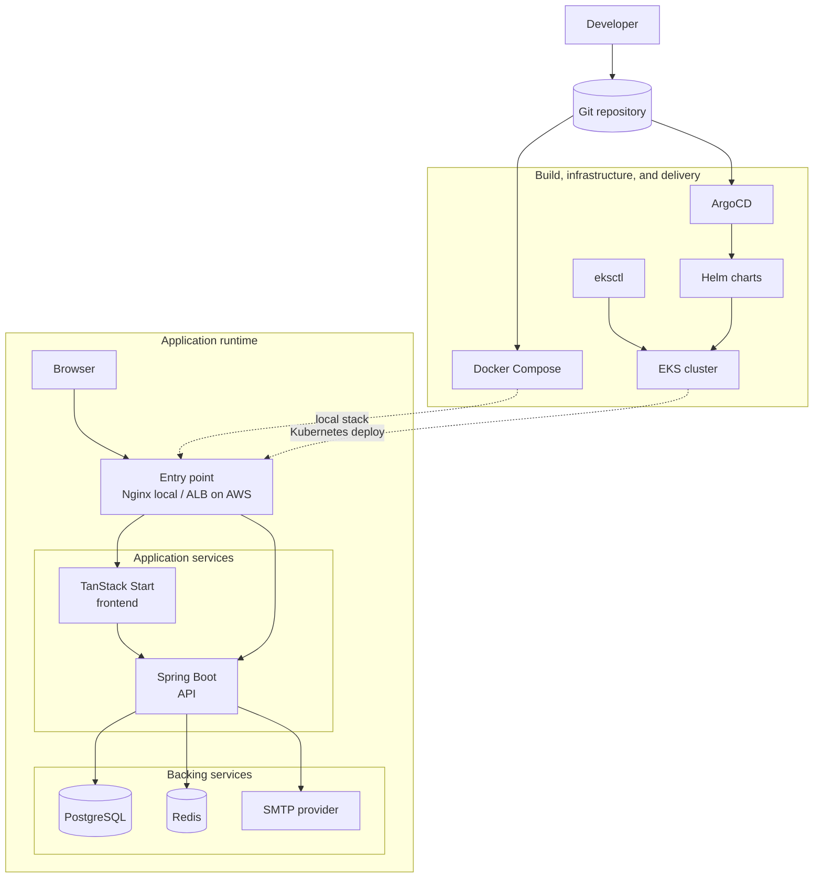

# Code Vault

Code Vault is a full-stack snippet manager for saving, searching, organizing, and reusing code snippets. The repository contains a TanStack Start frontend, a Spring Boot API, local Docker Compose orchestration, AWS EKS deployment support through `eksctl`, and GitOps manifests for Kubernetes delivery.

## Architecture

### System Diagram



The local Compose stack exposes Nginx on port `80`, the frontend on `3000`, the backend on `8080`, PostgreSQL on `5432`, and Redis on `6379`. In Kubernetes, the frontend and backend are deployed through Helm charts and can be reconciled by ArgoCD.

## Repository Layout

```text
code_vault/
├── client/              TanStack Start, React 19, Vite, Tailwind frontend
├── server/              Spring Boot 4 API, Flyway migrations, JWT auth
├── git-ops/             ArgoCD applications and Helm charts
├── docker-compose.yml   Full local stack with Nginx, apps, PostgreSQL, Redis
├── nginx.conf           Local reverse proxy routes for / and /api
└── README.md
```

## Main Capabilities

- Snippet CRUD with title, description, language, tags, and favorite state.
- Collections for grouping related snippets.
- PostgreSQL full-text search backed by Flyway-managed schema migrations.
- User dashboard and admin dashboard metrics.
- Stateless JWT authentication with refresh-token cookies.
- Redis-backed caching and Bucket4j distributed rate limiting.
- Docker, Helm, ArgoCD, and `eksctl` support for local and AWS EKS deployment.

## Tech Stack

| Area           | Tools                                                                                           |
| -------------- | ----------------------------------------------------------------------------------------------- |
| Frontend       | React 19, TanStack Start, TanStack Router, React Query, Vite 8, Tailwind CSS 4, Biome, Vitest   |
| Backend        | Java 25, Spring Boot 4.0.6, Spring Security, Spring Data JPA, Flyway, Spring Cache, Spring Mail |
| Data           | PostgreSQL, Redis                                                                               |
| Delivery       | Docker Compose, Nginx, Helm, ArgoCD                                                             |
| Infrastructure | AWS EKS with `eksctl`                                                                           |

## Prerequisites

- Docker and Docker Compose
- Java 25 for local backend development
- Node.js 20+ for local frontend development
- AWS CLI, `eksctl`, kubectl, and Helm for EKS/Kubernetes workflows

## Quick Start

Create `server/.env` before starting the backend. Use [server/README.md](server/README.md) for the full variable list.

Run the complete stack:

```bash
docker compose up --build -d
```

Open:

- App through Nginx: `http://localhost`
- Frontend directly: `http://localhost:3000`
- Backend directly: `http://localhost:8080`
- Swagger UI: `http://localhost:8080/swagger-ui/index.html`

For local hot reload, start only PostgreSQL and Redis, then run the backend and frontend separately:

```bash
docker compose -f server/compose.yaml up -d
```

```bash
cd server
./gradlew bootRun
```

```bash
cd client
npm install
npm run dev
```

On Windows, use `.\gradlew.bat bootRun` for the backend.

## Deployment Docs

- Frontend details: [client/README.md](client/README.md)
- Backend details: [server/README.md](server/README.md)
- Kubernetes and GitOps deployment: [git-ops/README.md](git-ops/README.md)

Recommended deployment order:

1. Create or select an EKS cluster with `eksctl`.
2. Install cluster add-ons required by the manifests, including ArgoCD and the AWS Load Balancer Controller if using the ALB ingress.
3. Configure Kubernetes secrets and image tags.
4. Apply ArgoCD applications from `git-ops/applications/`.

## Security Notes

- Do not commit production secrets. The checked-in GitOps secret values should be replaced with a safer workflow such as Sealed Secrets, External Secrets Operator, AWS Secrets Manager, or manually managed Kubernetes secrets.
- `JWT_SECRET`, database credentials, SMTP credentials, and CORS/frontend URLs must be environment-specific.
- Refresh tokens are stored in secure cookies by the backend; production should serve the app over HTTPS.
