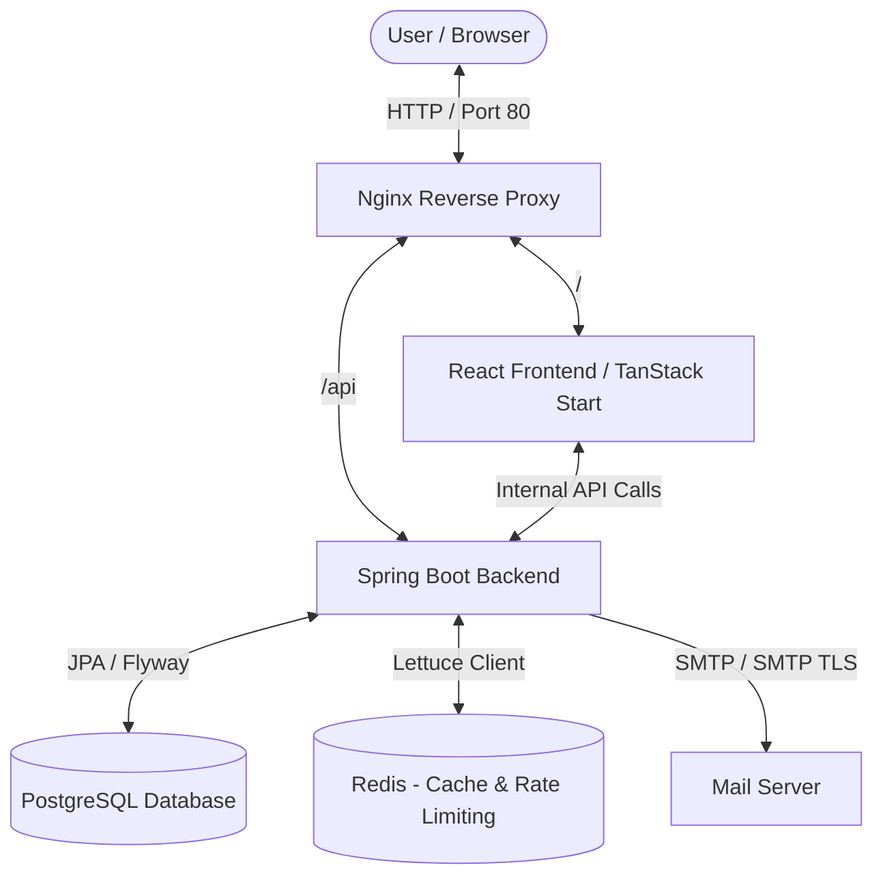

# Code Vault 🔐

Code Vault is a professional, modern, secure, and performant web application designed for developers to store, organize, search, and manage reusable code snippets. Built with a robust **Spring Boot (Java 25)** backend and a cutting-edge **TanStack Start (React 19 & Vite 8)** frontend, it represents an enterprise-grade solution for keeping track of developer knowledge.

---

## 🏗️ System Architecture

Code Vault utilizes a modern, decoupled architecture separating the rich, client-side application from the stateless API services, fronted by an Nginx reverse proxy.



- **Reverse Proxy**: Nginx acts as the single entry point, routing client traffic transparently (APIs to backend, static/dynamic routing to frontend).
- **Frontend**: A server-run TanStack Start application providing fast initial loads, SEO optimization, and a client-side Single Page Application (SPA) experience with type-safe routing.
- **Backend**: A Spring Boot API featuring high-performance Java 25, stateless JWT auth, distributed rate-limiting, PostgreSQL full-text search, and Redis caching.
- **Cache & Storage**: Redis handles Bucket4j rate-limiting states and Spring Cache DTO storage, while PostgreSQL stores users, roles, snippets, tags, and collections.
- **Mailer**: Spring Mail handles SMTP tasks for OTP verification and password reset flows.

---

## ⚡ Key Features

- **Snippet Library**: Store reusable code blocks with full syntactic context (title, description, programming language, custom tags).
- **Advanced Full-Text Search**: Powered by PostgreSQL GIN indexes, allowing users to search code, titles, and descriptions dynamically.
- **Collections & Organization**: Group related snippets into project-based or framework-based Collections (e.g., "React Hooks", "Docker configurations").
- **Language Analytics**: An interactive dashboard showing metrics on total snippets, favorite counts, collections, and a visual breakdown of your programming language mix.
- **Distributed Rate Limiting**: Bulletproof API protection using Redis-backed Bucket4j token bucket rate limiting (200 requests/min for authenticated users; 30 requests/min for anonymous users).
- **Robust Authentication**: Dual-token JWT system utilizing memory-stored Access Tokens and secure `HttpOnly` Refresh Token Cookies, complete with automated Axios refreshing queue.
- **Admin Dashboard**: Full administrative capability including system statistics (totals of users, snippets, tags, collections), paginated user list search, user account deletion, and role assignment.

---

## 🛠️ Technology Stack

| Component | Technology | Version / Details |
| :--- | :--- | :--- |
| **Backend Core** | Java | 25 |
| **Backend Framework** | Spring Boot | 4.0.6 |
| **Database** | PostgreSQL | Latest |
| **Cache & Limiter** | Redis (Lettuce) | Latest |
| **Caching Integration** | Spring Cache | Configured with Jackson JSON Serialization |
| **Database Migration** | Flyway | Integrates with Spring Data JPA |
| **Security** | Spring Security | JWT stateless & BCrypt hashing |
| **Rate Limiter** | Bucket4j | Redis-backed token bucket |
| **Frontend Framework** | React | 19.2.0 |
| **Meta-Framework** | TanStack Start | Latest (Vite 8 driven, Nitro server) |
| **Routing** | TanStack Router | File-based, type-safe routing |
| **State Management** | Zustand & React Query | Global UI state & server data fetching |
| **Containerization** | Docker & Compose | Multi-stage builds & Nginx routing |
| **GitOps & Packaging** | Helm & ArgoCD | Declarative Kubernetes deployment model |
| **Code Formatting** | Biome | 2.4.5 (linter & formatter) |
| **Styling** | Tailwind CSS | v4.1.18 |

---

## 🚀 Quick Start & Development Setup

Follow these steps to spin up the workspace, either inside fully containerized environments or in hybrid developer mode.

### Prerequisites
- [Docker & Docker Compose](https://www.docker.com/)
- [Java Development Kit (JDK) 25](https://jdk.java.net/25/) (For hybrid development)
- [Node.js v20+](https://nodejs.org/) (For hybrid development)

---

### Option A: Complete Stack via Docker Compose (Recommended)
You can run the entire system, including databases, apps, and proxy, inside container environments:
1. Ensure you have the `.env` file configured in the `server` directory.
2. Run the following command from the root directory:
   ```bash
   docker compose up --build -d
   ```
3. The stack is mapped as follows:
   - **Nginx Entrypoint**: `http://localhost` (Port 80)
   - **Frontend App**: Direct container at `http://localhost:3000` (or via proxy at `http://localhost`)
   - **Backend API**: Direct container at `http://localhost:8080` (or via proxy at `http://localhost/api`)
   - **PostgreSQL**: `localhost:5432` (db: `code-vault`, user: `meet`, password: `1234`)
   - **Redis**: `localhost:6379` (no auth)

---

### Option B: Hybrid Developer Mode (Local Hot-Reload)

#### Step 1: Spin up Databases (Docker Compose)
From the root directory, start only the PostgreSQL and Redis containers:
```bash
docker compose -f server/compose.yaml up -d
```

#### Step 2: Run the Backend Server
1. Navigate to the `server` directory.
2. Ensure you have the `.env` file configured.
3. Start the Spring Boot application:
   - On Windows: `.\gradlew.bat bootRun`
   - On macOS/Linux: `./gradlew bootRun`

The backend runs on `http://localhost:8080` (with API endpoints starting at `/api`).

#### Step 3: Run the Frontend Client
1. Navigate to the `client` directory.
2. Install dependencies:
   ```bash
   npm install
   ```
3. Start the dev server:
   ```bash
   npm run dev
   ```

The client will start on `http://localhost:3000`.

---

## 📁 Repository Structure

```
code_vault/
├── client/                 # TanStack Start / React frontend
│   ├── src/                # Frontend source code
│   │   ├── api/            # Axios API config & interceptors
│   │   ├── components/     # Global & UI (shadcn) components
│   │   ├── features/       # Feature-sliced modules (auth, snippets, admin...)
│   │   ├── routes/         # File-based routes & layout wrappers
│   │   └── styles.css      # Core styles & Tailwind CSS imports
│   ├── Dockerfile          # Multi-stage Docker build for client runner
│   └── package.json        # Frontend dependencies & scripts
├── server/                 # Spring Boot / Gradle backend
│   ├── src/main/java/      # Java classes
│   │   ├── common/         # Security, rate-limiting, and utilities
│   │   └── features/       # Business modules (auth, snippets, users...)
│   ├── src/main/resources/ # Configurations, migrations, and mail templates
│   │   ├── db/migration/   # Flyway database schemas
│   │   └── application.yaml# Spring configuration property tree
│   ├── Dockerfile          # Multi-stage Java 25 build for server runtime
│   └── build.gradle        # Backend Gradle build configuration
├── git-ops/                # GitOps declarative delivery manifests
│   ├── applications/       # ArgoCD Application manifest yaml files
│   └── charts/             # Helm charts for frontend, backend, postgres, redis
├── docker-compose.yml      # Root orchestrator for full local Nginx-proxied stack
├── nginx.conf              # Reverse proxy configuration routing /api and root /
└── README.md               # You are here
```

---

## 💾 Redis Caching Layer

To optimize performance and minimize database query load on high-traffic endpoints, Code Vault implements a distributed caching strategy powered by Redis and Spring Cache.

### Caching Strategy
- **Targeted Endpoints**: Caching is enabled for read-heavy operations, specifically:
  - Global Admin Dashboard Statistics (`admin-dashboard`)
  - User Dashboard Statistics (e.g., total snippets `snippet-count`, total favorites `favourite-count`, collection count `collection-count`)
  - User Recent Snippets list (`recent-snippets`)
  - User Programming Language breakdown (`language-counts`)
- **TTL (Time-To-Live)**: Cached values expire automatically after **10 minutes** as defined in `application.yaml` via `spring.cache.redis.time-to-live`.
- **Serialization**: Utilizes a custom `GenericJacksonJsonRedisSerializer` configured in [RedisConfig.java](file:///e:/Works/temp/code_vault/server/src/main/java/com/meet/server/common/redis/RedisConfig.java) with default typing enabled. This allows caching type-safe JSON objects and complex collections rather than using raw Java serialization.

### Cache Eviction (Consistency)
To prevent stale data, cache eviction is triggered dynamically upon mutating actions using `@CacheEvict` or `@Caching` annotations:
- **Snippet Creation/Deletion/Update**: Automatically evicts `snippet-count`, `language-counts`, `recent-snippets`, and `admin-dashboard` caches.
- **Collection Creation**: Automatically evicts `collection-count` and `admin-dashboard` caches.
- **Toggling Favorites**: Automatically evicts the `favourite-count` cache.

---

## 🤖 GitOps & Kubernetes Deployment (Helm & ArgoCD)

Code Vault supports declarative Kubernetes deployments using a GitOps model. 

- **Packaging**: **Helm** is used to package each microservice, allowing parameterization of configuration values (ports, resource limits, secrets).
- **Lifecycle & Continuous Delivery**: **ArgoCD** applications are configured to track the `git-ops/applications` directory and continuously reconcile the cluster state against the repository configuration.

For complete details on GitOps structure, Helm values, secrets, and deployment instructions, refer to the [GitOps README](file:///e:/Works/temp/code_vault/git-ops/README.md).

---

## 🔐 Security & Operations

1. **Passwords**: Stored securely in PostgreSQL, hashed via `BCryptPasswordEncoder` with a strength factor of 12.
2. **Access Control**: Role-based access configuration (e.g., `ROLE_ADMIN` required for admin endpoints).
3. **Session Policy**: Fully stateless REST api. No session state is held on the server; authorization is evaluated from incoming JWT Bearer tokens.
4. **Token Expiry**:
   - Access Token: Shorter-lived JWT checked on every API call.
   - Refresh Token: Stored in an HttpOnly, Secure, and SameSite cookie, utilized to fetch a new Access Token upon expiration.
