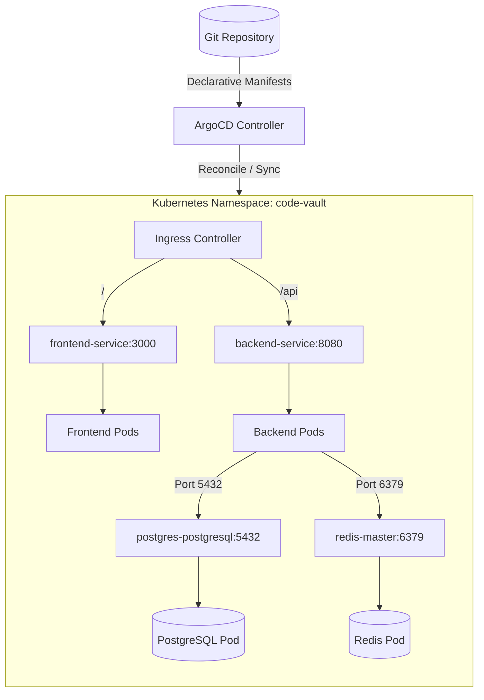

# GitOps & Kubernetes Deployment Guide ☸️

This directory contains the declarative infrastructure and packaging manifests for deploying Code Vault to a Kubernetes cluster using the **GitOps paradigm**.

By separating application logic from deployment state, the system ensures reproducibility, automated synchronization, and disaster recovery.

---

## 🏗️ GitOps Deployment Architecture

We utilize **Helm** for packaging and parameterizing each microservice, and **ArgoCD** to continuously monitor the git repository and synchronize the live Kubernetes cluster state with the manifests defined here.



---

## 📂 GitOps Directory Structure

```
git-ops/
├── applications/             # ArgoCD Application Manifests
│   ├── frontend.yml          # Front-end React application deployment
│   ├── backend.yml           # Spring Boot API deployment
│   ├── postgres.yml          # PostgreSQL deployment configuration
│   └── redis.yml             # Redis cache and rate-limiting deployment
├── charts/                   # Helm Charts
│   ├── frontend/             # Custom Helm chart for TanStack Start Frontend
│   ├── backend/              # Custom Helm chart for Spring Boot Backend
│   │   └── secrets.yml       # Configuration secret schemas & environmental templates
│   ├── postgres/             # PostgreSQL values configuration overrides
│   └── redis/                # Redis values configuration overrides
└── README.md                 # You are here
```

---

## 🤖 ArgoCD Application Manifests

Located in [git-ops/applications](file:///e:/Works/temp/code_vault/git-ops/applications), these manifests define how ArgoCD tracks and deploys the charts. Each application is configured with:
* **Target Repository**: `https://github.com/Meet-08/code_vault.git`
* **Target Namespace**: `code-vault`
* **Sync Policy**: Automated with `prune: true` (removes resources deleted from Git) and `selfHeal: true` (reverts manual changes in the cluster to maintain drift-free state).

Example Application Manifest:
```yaml
apiVersion: argoproj.io/v1alpha1
kind: Application
metadata:
  name: backend
  namespace: argocd
spec:
  project: default
  source:
    repoURL: https://github.com/Meet-08/code_vault.git
    targetRevision: HEAD
    path: git-ops/charts/backend
  destination:
    server: https://kubernetes.default.svc
    namespace: code-vault
  syncPolicy:
    automated:
      prune: true
      selfHeal: true
```

---

## ⛵ Helm Charts & Configuration

All applications and dependencies are packaged using Helm charts under [git-ops/charts](file:///e:/Works/temp/code_vault/git-ops/charts).

### 1. Frontend Chart (`charts/frontend`)
* **Role**: Deploys the containerized TanStack Start client built via Node.js runner.
* **Service**: Exposed as a `ClusterIP` service on port `3000`.
* **Probes**: Configured with default liveness and readiness path pointing to `/`.
* **Scalability**: Custom parameters inside `values.yaml` control `replicaCount` and optional `autoscaling` options.

### 2. Backend Chart (`charts/backend`)
* **Role**: Deploys the Spring Boot application (built on Java 25 runtime).
* **Service**: Exposed as a `ClusterIP` service on port `8080`.
* **Secret Binding**: Automatically injects dynamic environment variables using a templated secret mapping from `secrets.yml`.

### 3. PostgreSQL Override (`charts/postgres`)
* **Role**: Provisions PostgreSQL database storage using the official Bitnami PostgreSQL chart.
* **Storage overrides**: Configured with:
  * Persistent volume claims enabled (Size: `5Gi`).
  * Dedicated service account credentials mapping to `postgres-secret`.
  * CPU/Memory constraints (`requests.cpu: 200m`, `requests.memory: 512Mi`).

### 4. Redis Override (`charts/redis`)
* **Role**: Provisions Redis using the official Bitnami Redis chart.
* **Caching configuration overrides**:
  * Authentication disabled for internal cluster communication.
  * Persistence disabled (`master.persistence.enabled: false`) to optimize cache speed.
  * Replica count set to `0` to keep overhead low.

---

## 🚀 Deployment Instructions

### Prerequisites
* A running Kubernetes cluster (e.g. Minikube, Kind, or EKS/GKE).
* `kubectl` and `helm` CLIs installed.
* ArgoCD installed in your cluster (if using option A).

---

### Option A: Deploying via ArgoCD (GitOps Mode)

1. Create the application namespace:
   ```bash
   kubectl create namespace code-vault
   ```
2. Create the postgres secret containing database root password credentials:
   ```bash
   kubectl create secret generic postgres-secret \
     --from-literal=postgres-password="[PASSWORD]" \
     --from-literal=password="[PASSWORD]" \
     -n code-vault
   ```
3. Apply the ArgoCD application manifests:
   ```bash
   kubectl apply -f git-ops/applications/ -n argocd
   ```
4. ArgoCD will detect the manifests, compile the Helm templates, and build all the deployment, service, secrets, ingress, and statefulsets configurations automatically.

---

### Option B: Deploying manually via Helm

If you do not use ArgoCD, you can deploy the stack manually using Helm from the repository root:

1. Create the application namespace:
   ```bash
   kubectl create namespace code-vault
   ```
2. Provision Databases:
   * Deploy PostgreSQL (Bitnami dependency):
     ```bash
     helm install postgres oci://registry-1.docker.io/bitnamicharts/postgresql \
       -f git-ops/charts/postgres/values.yml \
       -n code-vault
     ```
   * Deploy Redis (Bitnami dependency):
     ```bash
     helm install redis oci://registry-1.docker.io/bitnamicharts/redis \
       -f git-ops/charts/redis/values.yml \
       -n code-vault
     ```
3. Deploy Application Services:
   * Deploy Spring Boot API:
     ```bash
     helm install backend git-ops/charts/backend \
       -f git-ops/charts/backend/secrets.yml \
       -n code-vault
     ```
   * Deploy React Client:
     ```bash
     helm install frontend git-ops/charts/frontend \
       -n code-vault
     ```
