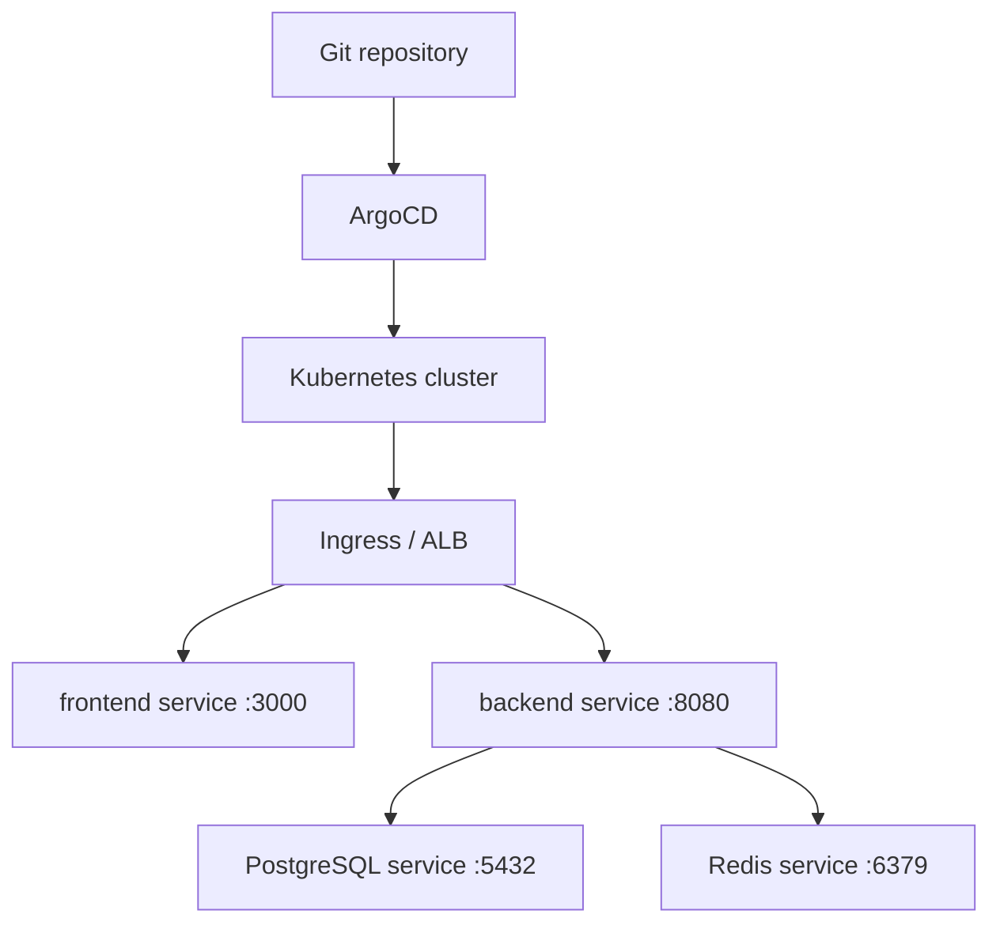

# GitOps Deployment

This directory contains the Kubernetes deployment layer for Code Vault. It uses ArgoCD Application manifests to reconcile Helm charts for the frontend, backend, PostgreSQL, and Redis.

## Directory Layout

```text
git-ops/
├── applications/
│   ├── backend.yml
│   ├── frontend.yml
│   ├── postgres.yml
│   └── redis.yml
├── charts/
│   ├── backend/
│   ├── frontend/
│   ├── postgres/
│   └── redis/
└── README.md
```

## Deployment Model



The application manifests in [applications](applications) point ArgoCD at the chart paths under [charts](charts), deploy into the `code-vault` namespace, and enable automated sync with pruning and self-healing.

## Charts

| Chart             | Purpose                                                                         |
| ----------------- | ------------------------------------------------------------------------------- |
| `charts/frontend` | Deploys the TanStack Start frontend image as a ClusterIP service on port `3000` |
| `charts/backend`  | Deploys the Spring Boot backend image as a ClusterIP service on port `8080`     |
| `charts/postgres` | Values for the Bitnami PostgreSQL chart                                         |
| `charts/redis`    | Values for the Bitnami Redis chart                                              |

The frontend and backend charts use images from `meetjbhuva/code-vault-client` and `meetjbhuva/code-vault-server` by default. Pin image tags for production instead of relying on `latest`.

## Ingress

[charts/frontend/ingress.yml](charts/frontend/ingress.yml) defines an AWS ALB ingress for:

- `/` to the frontend service on port `3000`
- `/api` to the backend service on port `8080`

It assumes:

- AWS Load Balancer Controller is installed.
- An ACM certificate exists in `ap-south-1`.
- DNS for `codevault.meet-08.me` points to the ALB.

Update the host, certificate ARN, and annotations for your environment.

## Deploy with ArgoCD

Prerequisites:

- A Kubernetes cluster.
- ArgoCD installed in the `argocd` namespace.
- `kubectl` configured for the cluster.
- Namespace and required secrets created.

```bash
kubectl create namespace code-vault
kubectl apply -f git-ops/applications/ -n argocd
```

ArgoCD will render and sync the referenced charts.

## Deploy Manually with Helm

From the repository root:

```bash
kubectl create namespace code-vault
```

```bash
helm install postgres oci://registry-1.docker.io/bitnamicharts/postgresql \
  -f git-ops/charts/postgres/values.yml \
  -n code-vault
```

```bash
helm install redis oci://registry-1.docker.io/bitnamicharts/redis \
  -f git-ops/charts/redis/values.yml \
  -n code-vault
```

```bash
helm install backend git-ops/charts/backend \
  -f git-ops/charts/backend/secrets.yml \
  -n code-vault
```

```bash
helm install frontend git-ops/charts/frontend \
  -n code-vault
```

## Operational Checks

```bash
kubectl get applications -n argocd
kubectl get pods -n code-vault
kubectl get svc -n code-vault
kubectl get ingress -n code-vault
```

If the ALB ingress is used, also check the AWS Load Balancer Controller logs when the ingress does not provision.
